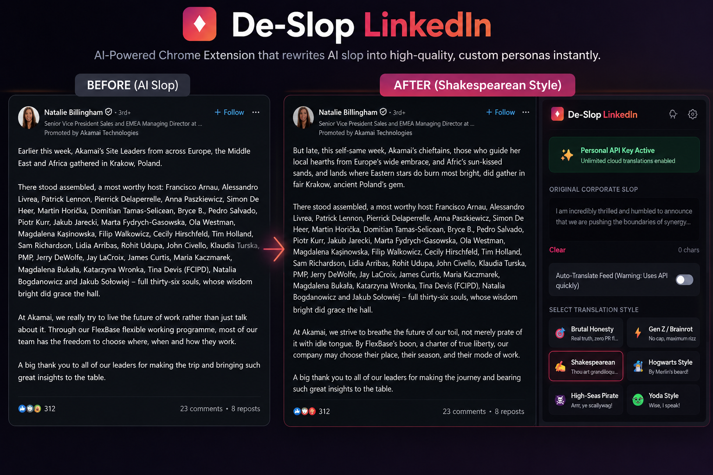

# De-Slop LinkedIn ✨

  

Rescue your feed from boring corporate AI-slop! **De-Slop LinkedIn** is a lightweight, privacy-focused Manifest V3 Chrome Extension that rewrites generic, buzzword-heavy LinkedIn posts and editor drafts into fun, engaging personas (or brutal, direct honesty) using the Gemini 2.5 Flash API.

---

## 🚀 Key Features

*   **🛡️ Secure Gemini Nano Trial**: Try the extension immediately! If supported, the first **5 translations run locally** on your device's hardware using Chrome's native `window.ai.languageModel` (Gemini Nano) – zero setup required.
*   **🎭 Custom Personas Manager**: Create, edit, and delete your own custom translation personas. Define a unique name, select an emoji, and write custom prompt guidelines that dynamically blend into the extension's UI.
*   **⚡ Ultra-Optimized Auto-Pilot**: Automatically translates your feed as you scroll.
    *   *Viewport Spacing:* Spaced using a **4-second start-to-start timing model** that optimizes speed while staying strictly under free-tier limits (20 RPM).
    *   *Queue Pruning:* Automatically prunes off-screen posts from the queue so you don't waste your API quota on scrolled-past content.
    *   *Rate-Limit Shield:* Robust error classification (matching 429/403/exhausted responses) pauses the queue for 60 seconds if rate limits are reached.
*   **✨ Smart De-Slopper Buttons**: Injected natively into your LinkedIn feed next to post descriptions. Toggle between original and rewritten text instantly.
*   **🤖 Post Composer Integration**: A floating widget in the post editor helps you rewrite your drafts before posting.
*   **🔒 Privacy First**: Your personal API key is stored safely inside your browser's local storage and calls Gemini directly. No external analytics, trackers, or databases are used.

---

## 🎭 Default Personas
*   **🎯 Brutal Honesty** - Cuts out the PR fluff and says what they actually mean.
*   **⚡ Gen Z / Brainrot** - Maximum rizz, no cap, pure internet brainrot.
*   **✍️ Shakespearean** - Grandiloquent Early Modern English.
*   **🧙‍♂️ Hogwarts Style** - Wizarding terminology and British phrasing.
*   **🏴‍☠️ High-Seas Pirate** - Classic pirate vocabulary and nautical metaphors.
*   **👽 Yoda Style** - Unique inverting grammar order.
*   **🔥 Anime Protagonist** - Hyper-energetic, dramatic, and emotionally intense.
*   **🦾 Cyberpunk Choom** - Gritty, low-life corporate slang.

---

## 🛠️ How to Install

1.  **Download the Source Code**:
    *   Clone this repository: `git clone https://github.com/1himanshu1804442/De-slop-Linkedin.git`
    *   Or download the source code as a ZIP file and extract it.
2.  **Open Chrome Extensions page**:
    *   Open Google Chrome and navigate to `chrome://extensions/`.
3.  **Enable Developer Mode**:
    *   Toggle the **Developer mode** switch in the top-right corner to **ON**.
4.  **Load the Extension**:
    *   Click the **Load unpacked** button in the top-left.
    *   Select the directory containing the project files (where `manifest.json` is located).

---

## 🔑 Setup & API Configuration

To get started, the extension checks your browser capabilities and credentials:

1.  **On-Device Trial**: If your browser supports Gemini Nano, the extension will run in **Local AI Trial** mode for your first 5 translations.
2.  **Google AI Studio Key**: To unlock unlimited translations, get a free API key from [Google AI Studio](https://aistudio.google.com/).
3.  Click the **De-Slop LinkedIn** extension icon in your toolbar.
4.  Click the **Settings (Gear) ⚙️** icon in the header.
5.  Paste your API key and click **Save Key** (switches status to **Personal API Key Active**).
6.  Refresh your LinkedIn page to start de-slopping!

---

## 🏗️ Architecture & Technical Stack

*   **Platform**: Chrome Extensions Manifest V3
*   **Frontend**: Vanilla HTML / CSS / JS (No heavy frameworks or bundlers for rapid loading)
*   **Styling**: Modern dark-mode popup design with sleek gradients, glassmorphism, and custom UI transitions.
*   **DOM Isolation**: Injected elements are isolated using **Shadow DOM** to prevent LinkedIn’s style sheets from clashing with the extension's widgets.
*   **State Management**: React-safe text insertion using simulated events for the editor component.
*   **Security**: Chrome Extension Service Worker (`background.js`) handles all API fetch operations to avoid Content Security Policy (CSP) blocking.

---

## 📜 License

Distributed under the MIT License. See `LICENSE` for more information.
